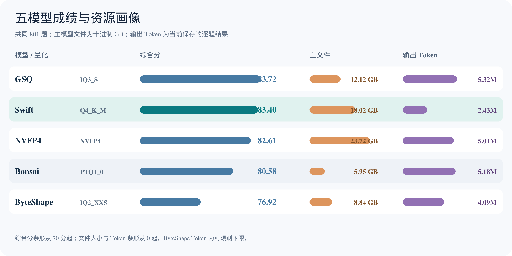
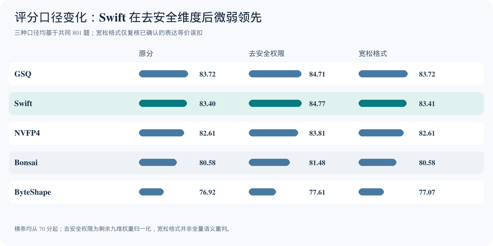
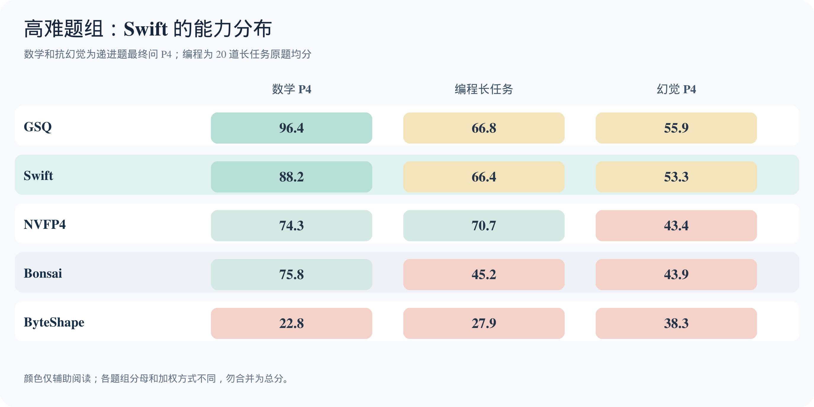

# Swift 与四款量化模型：同题成绩接近榜首，输出 Token 明显更少

**测评对象：Swift、GSQ、NVFP4、Bonsai、ByteShape。数据截点：2026-09-25。** 本报告是一份独立的五模型测评，包含 123 道递进子题重跑后的当前正式结果。除特别说明外，横向比较均使用五款模型共有的 **801 题、十个维度**。

## 前言：Swift 是怎样的模型

[Swift-Qwen3.8-27B-GGUF 模型卡](https://huggingface.co/ukisai/Swift-Qwen3.8-27B-GGUF)将 Swift 描述为基于 Qwen3.8-27B 的“推理效率”改造版，目标是在尽量保持答题能力的同时缩短思考过程。发布方称，训练时针对容易引发过度思考的推理标记进行微调，并加入来自 ThinkingCap-Qwen3.6-27B 的迁移组件。模型卡给出的 BF16 对照实验显示，多项基准的平均 Token 有约 24%–51% 的降幅；其中 GPQA-Diamond 的思考 Token 减少 41%，Terminal-Bench 2.1 的平均 Token 减少 26.5%。模型卡概述中的“思考 Token 减少 58.3%”对应其所列部分统计口径，**不能直接套到本报告的 GGUF 实测**。

本次实际测试的是 **Q4_K_M GGUF**，主模型文件 **18.02 GB**。模型卡称这一量化档面向 24 GB 显卡的日常使用；需要长时 Agent 任务或严格工具调用格式时，发布方建议 Q6_K 或更高档。模型带有图像输入投影文件和 MTP 预测层，但本报告的文件体积仅计被测主模型文件，也没有把模型卡的多模态或投机解码宣称视为本次测试结论。模型卡披露的混合架构为 64 个块中 48 个递归块、16 个全注意力块，KV 缓存约每 Token 64 KiB；实际运行资源仍取决于上下文长度、后端与配置。

下文把**发布方自述**与**本地同题实测**分开。尤其是“相对原版 Qwen 节省多少 Token”需要同配置原版对照，本次五模型样本没有这个对照；我们只能比较五款参评版本在这套题和运行条件下的观测值。

## 执行摘要

- **综合能力处于第一梯队。** 同题十维总分 GSQ **83.72**、Swift **83.40**，仅差 **0.32 分**。五款模型没有一款在所有维度领先；Swift 在指令遵循、数据提取、CLI 深度任务和结构化输出四项第一。
- **生成量是 Swift 最明确的优势。** 801 题当前最终响应的输出 Token：Swift **2,429,372**，GSQ **5,324,312**，NVFP4 **5,006,150**，Bonsai **5,176,087**；Swift 约为 GSQ 的 **46%**。五款模型中的 ByteShape 至少 **4,088,465**，有一题缺失 Token 记录。Token 较少并不自动等于费用或墙钟耗时按同一比例下降。
- **高难任务呈现明显分工。** Swift 数学递进最终问 P4 为 **88.2**，落后 GSQ 的 **96.4**；20 道编程长任务均分 **66.40**，与 GSQ **66.75** 接近，但其中重构题 **72.70** 居五款第一，调试题仅 **58.38**。复杂证据递进题 P4 只有 **53.3**，任何高分模型都还需要外部证据核查。
- **替代计分不改变主要判断。** 去掉安全权限后 Swift **84.77**、GSQ **84.71**，前两名换位但只差 0.06。只修复经逐题核实的格式等价误扣时，Swift **83.41**，GSQ **83.72**，其余梯队不变。

## 1. 📊 五模型总成绩、量化等级和体积

| 模型 | 被测量化档 | 主模型文件 | 同题十维总分 | 去安全权限 | 宽松格式¹ | 原运行十一维总分 | 原运行题数/通过题数 |
|---|---|---:|---:|---:|---:|---:|---:|
| GSQ-RCO | IQ3_S | 12.12 GB | **83.72** | 84.71 | 83.72 | 84.02 | 831 / 735 |
| **Swift Qwen3.8 27B** | **Q4_K_M** | **18.02 GB** | **83.40** | **84.77** | **83.41** | **83.73** | **806 / 700** |
| Qwen3.8 27B NVFP4 | NVFP4 | 23.72 GB | 82.61 | 83.81 | 82.61 | 不适用² | 801 / 699 |
| Bonsai-2 Q1 | PTQ1_0 | 5.95 GB | 80.58 | 81.48 | 80.58 | 80.75 | 831 / 706 |
| ByteShape IQ2_XXS | IQ2_XXS，混合量化 | 8.84 GB | 76.92 | 77.61 | 77.07 | 76.85 | 806 / 627 |

¹ “宽松格式”仅恢复已核实的纯表达误扣，是保守复核分，不是官方分数或全量语义重判。² NVFP4 的正式成绩分布在互补的 444 题和 357 题运行中，缺少五道 `agent_loop`，故无可比的十一维原运行总分。原运行通过率的题数分母不同，主榜一律按共同 801 题加权分排序。

主模型体积来自本机实际被测文件的字节数，按十进制 GB（10⁹ 字节）显示，不含视觉投影、MTP 草稿文件、KV 缓存和运行时显存。NVFP4 使用 `.ninfer` 封装，不能把其文件大小与 GGUF 当作完全同口径的显存比较。Bonsai 的 PTQ1_0 是三值化方案；ByteShape 的 IQ2_XXS 发行版为混合量化。**Swift 的 18.02 GB 比 GSQ 的 12.12 GB 大 5.90 GB，却用约 54% 更少的输出 Token 达到接近的总分**：部署时应同时看存储/显存和生成量。

### 同一题库下的两种替代成绩

“去安全权限”是从共同题集排除 `safety_authority`，其余九维保留原题分和原权重，再把权重和 **0.87** 归一化。它衡量总分对安全维度的敏感性，并不是把安全题改判正确。Swift 以 **84.77** 略高于 GSQ **84.71**，优势只有 **0.06 分**；这类微差不能作为稳定排名证据。安全权限本身仍是重要实际能力：Swift **71.48**，低于 GSQ **75.06**。

“宽松格式”仅对保留原回答并确认**语义正确、纯因形式失分**的条目做反事实修正。本报告涉及 Swift 的 `CLI-CN-034`（版本号 `2.31.0` 被数值解析成 `2.31`）和 ByteShape 的 `RM-CN-014`、`CLI-CN-034`。Swift **+0.01 分**、ByteShape **+0.15 分**；GSQ、NVFP4、Bonsai 不变。`ANSWER:` 前缀、括号、标点等可被宽松对待的表达问题只在逐题可验证时修复；JSON/schema、工具协议和指令格式本身是测试目标时继续按原规则评分。裁定清单及原回答哈希见[格式复核记录](evidence/format-adjudications.json)，五模型的替代计分结果见[替代计分数据](evidence/scoring-variants.json)。

## 2. 十个维度的完整成绩

各单元格为同题 801 题中该维度的现行加权分，**不是通过率**。加粗表示五款模型中的最高分。

| 维度（总分权重） | GSQ | **Swift** | NVFP4 | Bonsai | ByteShape |
|---|---:|---:|---:|---:|---:|
| 编程 17% | 71.40 | 68.73 | **73.53** | 66.13 | 63.53 |
| 数学推理 12% | **94.57** | 92.02 | 91.39 | 82.35 | 58.90 |
| 幻觉抵抗 12% | **83.82** | 83.44 | 82.53 | 80.12 | 79.66 |
| 指令遵循 12% | 83.52 | **92.18** | 84.75 | 81.62 | 92.15 |
| 安全与权限 10% | **75.06** | 71.48 | 72.16 | 72.73 | 70.93 |
| Agent 工作流 8% | **87.40** | 79.22 | 86.52 | 86.88 | 80.04 |
| 工具/CLI 工作流 7% | 83.98 | 85.25 | 85.58 | **89.23** | 87.78 |
| 数据提取 7% | 83.18 | **86.16** | 79.43 | 84.45 | 78.22 |
| CLI 深度任务 7% | 94.28 | **95.24** | 87.24 | 91.94 | 88.43 |
| 结构化输出 5% | 96.78 | **98.93** | 95.86 | 96.26 | 96.42 |

十维之外的**多轮 Agent 闭环**只有五题：Swift **94.46**、GSQ **91.46**、Bonsai **87.54**、ByteShape **74.75**；NVFP4 未测。它不是上表 `agent_workflow` 的同义项：Swift 在五题闭环上很强，但较大范围的 Agent 工作流只有 **79.22**，比 GSQ 低 **8.18 分**。不能用五道题覆盖这个短板。

Swift 的高分集中于明确输入/输出契约的任务：指令、提取、CLI 深度任务、结构化输出均领先。其短板集中于需要连续工具决策、权限判断和故障定位的任务；因此“更短的推理链”在本轮并没有表现为全面能力领先，而是以更少输出 Token 保留了多数能力，具体取舍因任务而异。

## 3. 🧮 数学推理：高分延续至末问，但仍落后 GSQ

数学递进题共 **17 组四问**；P2–P4 按真实前文重新作答。下表为各阶段原题均分。

| 模型 | 数学维度 | P1 | P2 | P3 | P4 |
|---|---:|---:|---:|---:|---:|
| GSQ | **94.57** | 100.0 | 85.3 | 94.1 | **96.4** |
| **Swift** | **92.02** | 94.1 | **88.2** | 94.1 | 88.2 |
| NVFP4 | 91.39 | 100.0 | 79.4 | **100.0** | 74.3 |
| Bonsai | 82.35 | 82.4 | 82.4 | 70.6 | 75.8 |
| ByteShape | 58.90 | 52.9 | 35.3 | 32.4 | 22.8 |

Swift 的 P2/P3/P4 为 **88.2/94.1/88.2**，说明本轮短推理倾向没有导致它在数学最后一问崩盘；123 道全部递进子题均分 **76.57**，略高于 GSQ **76.48**。但数学 P4 的可验证结果仍比 GSQ 低 **8.2 分**，因此要解高难、长链数学题时，GSQ 是本组更强的已测选项。NVFP4 P3 全对而 P4 降到 74.3，显示最后证明/计算环节不稳定。ByteShape 从首问到末问逐级下降，不能凭指令高分推断数学能力。

Swift 并非没有实质性数学失误。例如 `MX3-08-P4` 的系数与方差计算错误；此类错误无法通过放宽 `ANSWER:` 或标点规则修复。

## 4. 💻 编程长任务：Swift 擅长重构，调试是弱项

| 模型 | 编程维度 | 20 道长任务均分 | 10 道重构 | 8 道调试 |
|---|---:|---:|---:|---:|
| NVFP4 | **73.53** | **70.70** | 63.60 | **73.75** |
| GSQ | 71.40 | 66.75 | 60.90 | 69.25 |
| **Swift** | **68.73** | **66.40** | **72.70** | **58.38** |
| Bonsai | 66.13 | 45.25 | 46.70 | 44.38 |
| ByteShape | 63.53 | 27.95 | 28.10 | 34.75 |

Swift 的 20 题长任务均分只比 GSQ 低 **0.35 分**，但两者内部结构不同：Swift 的重构 **72.70** 比 GSQ 高 **11.80 分**，调试 **58.38** 却比 GSQ 低 **10.87 分**、比 NVFP4 低 **15.37 分**。这意味着 Swift 适合先用于有清晰目标和可运行验收的结构调整；未知原因的多轮排错，应优先考虑 NVFP4，并执行完整测试。重构与调试两列仅覆盖有明确归类的 18 道题，其余两题仍纳入长任务总均分。长任务列是原题算术均分；编程维度会对这些题加更高权重，两个口径不应直接相加。

审计中的具体 Swift 失误包括：`CP-L4-CC-001` 编译失败、`CP-L3-SQL-007` 缺少可执行 SQL 首行、`CP-L4-SH-001` 部署脚本执行失败、`CP-L4-PY-002` 只通过 5/6 个隐藏测试。它们是可执行性或逻辑缺陷，不属于宽松格式要消除的扣分。Bonsai 与 ByteShape 的工具/CLI 分数较高，却分别只有 **45.25/27.95** 的编程长任务均分，说明命令流程能力不能代替跨文件修改能力。

## 5. 🛡️ 幻觉抵抗：Swift 接近 GSQ，但复杂证据两者都失分

| 模型 | 幻觉维度 | HX3 P1 | P2 | P3 | P4 |
|---|---:|---:|---:|---:|---:|
| GSQ | **83.82** | 82.3 | 76.1 | **54.2** | **55.9** |
| **Swift** | **83.44** | **82.2** | **76.9** | 53.5 | 53.3 |
| NVFP4 | 82.53 | 77.2 | 71.4 | 51.6 | 43.4 |
| Bonsai | 80.12 | 71.0 | 67.0 | 45.1 | 43.9 |
| ByteShape | 79.66 | 80.6 | 69.4 | 51.7 | 38.3 |

HX3 递进题把可确定与不可确定事实、来源冲突、时间有效性、因果边界和引用链完整性放在连续问答中。Swift P1/P2 有 **82.2/76.9**，P3/P4 降至 **53.5/53.3**；与 GSQ 的复杂后段分数非常接近，且都远未到可无复核使用的程度。模型若能拒答一些问题，不等于已经正确区分了所有证据边界。Swift 审计中的 `HX3-03-P3` 和 `HX3-10-P3` 有结论或结构问题，不能仅归因为形式评分。

对于来源相互矛盾或时间敏感的事实，报告建议保留原始出处和“不确定”状态，重要结论由人工或外部确定性资料核验。安全权限维度 Swift **71.48**、五款中倒数第二，也表明涉及授权、执行边界的 Agent 任务不能只凭其较高的指令遵循分数放行。

## 6. 🪙 Token、时间与输出稳定性

以下按**共同 801 题当前保存的最终逐题响应**求和，输出 Token 通常包含推理 Token。它们不含 Judge、被覆盖的旧答案、重试，也不等于完整账单。推理耗时为各题时间之和；并行运行下**不是墙钟完成时间**。

| 模型 | 输入 Token | 输出 Token | 合计 Token | 每题输出 Token | 推理耗时合计 | 空输出 / 长度截断 |
|---|---:|---:|---:|---:|---:|---:|
| GSQ | 467,276 | 5,324,312 | 5,791,588 | 6,647 | 约 21.18 小时 | 2 / 3 |
| **Swift** | **423,025** | **2,429,372** | **2,852,397** | **3,033** | **约 10.09 小时** | **2 / 2** |
| NVFP4 | 469,857 | 5,006,150 | 5,476,007 | 6,250 | 约 18.99 小时 | 7 / 8 |
| Bonsai | 452,690 | 5,176,087 | 5,628,777 | 6,462 | 约 21.06 小时 | 13 / 13 |
| ByteShape | ≥400,801 | ≥4,088,465 | ≥4,489,266 | ≥5,104 | 约 13.81 小时 | 44 / 28 |

只看**本次重跑的 123 道递进子题**，Swift 输入/输出为 **148,989/678,981 Token**，合计 **827,970**；GSQ 为 **160,326/1,297,099**，NVFP4 **162,684/1,106,895**，Bonsai **156,481/1,386,784**，ByteShape **141,739/880,047**。Swift 在这 123 题的原题均分 **76.57**，五款中最高。这个“更少 Token、相近成绩”的模式在全题集和本次重跑子集同时出现，支持其作为 Token 预算敏感型候选；仍不能推断同硬件、同服务端的每秒速度或货币成本。

原运行摘要的 Token 合计与当前逐题记录不一致，可能因为 123 题重新作答替换了旧结果，而摘要未同步更新。因此本报告采用当前逐题记录，并明确无法从最终结果还原整个评测过程的真实累计消耗。ByteShape 有一题缺少 Token 元数据，表中为下限。NVFP4 的 357 题包有两道 Judge 失败待补判；ByteShape 有五道环境故障被隔离、空输出较多，两者的质量状态均为 `critical`，细小分差需谨慎解读。

## 7. 五款模型画像与选型

**Swift：高分且省生成量的主角。** 本次十维 **83.40**，比 GSQ 低 0.32，输出 Token 约少 54%。明确优势是指令 **92.18**、数据提取 **86.16**、CLI 深度任务 **95.24**、结构化输出 **98.93** 和长重构 **72.70**；数学 **92.02** 也处于高位。明确弱项是 Agent 工作流 **79.22**、安全权限 **71.48**、长调试 **58.38**，以及抗幻觉递进后段 **53.3**。适合约束清晰、结果可验证、重视输出预算的流程；复杂调试、证据综合和高权限操作需额外验收。

**GSQ：高难数学与可靠性更强的综合基准。** 十维第一 **83.72**，数学 **94.57**、P4 **96.4**，幻觉抵抗 **83.82**、Agent 工作流 **87.40**、安全权限 **75.06** 均领先 Swift。主文件 **12.12 GB** 也小于 Swift。代价是输出 Token 达 **5.32M**，且长重构 **60.90** 低于 Swift；复杂证据 P4 **55.9** 仍有限制。若高难数学或权限/流程稳健性更关键，优先比较 GSQ。

**NVFP4：编程及长调试第一。** 编程维度 **73.53**、20 道长任务 **70.70**、8 道调试 **73.75** 均居首。数学 **91.39** 也较强，但数学 P4 **74.3**、幻觉 P4 **43.4**，末段推理存在明显下滑。主包 **23.72 GB**，输出 **5.01M Token**，且缺少 Agent 闭环题和两道 Judge 判分。它最适合作为需要执行测试验证的复杂代码任务候选，而非未加限定的全维度第一。

**Bonsai-2 Q1：小文件、工具编排强，代码长任务弱。** **5.95 GB** 主文件换来十维 **80.58**；工具/CLI **89.23** 在五款中最高，Agent 工作流 **86.88** 也接近 GSQ。数学 **82.35** 尚可，但长编程 **45.25**、调试 **44.38**，且输出 **5.18M Token**，明显不像文件体积那样节省生成量。适合资源紧、以工具流程和短步骤为主的场景。

**ByteShape IQ2_XXS：极低比特量化保住格式能力，但复杂任务退化。** **8.84 GB**，指令 **92.15** 几乎与 Swift 持平，结构化输出 **96.42**、工具/CLI **87.78** 仍可观。然而数学 **58.90**、数学 P4 **22.8**、长编程 **27.95**、幻觉 P4 **38.3** 均明显偏低；44 道空输出、28 道长度截断与五道环境故障进一步限制其稳定性。仅适合作为经过专门题集验证的窄任务配置。

## 8. 计分方法、可信范围与复核

五款模型的交集为 **801 题、十个维度**。每个维度先按现行题目权重聚合：基础/中等/困难/对抗分别为 1/1.5/2/2.5；编程长任务权重 3；抗幻觉攻击等级再乘 1/1.2/1.5/2。十维总分按表中的维度权重加权，并除以权重和 **0.97**。原正式十一维多了权重 3% 的 `agent_loop`。123 道重跑题来自 41 组四问递进题的 P2–P4；其余题主要沿用当前已保存的候选输出，在修复后评分口径下复算。“重跑 123 道”不表示 801 题全部重新调用。

本报告比较的是**所列量化文件、推理配置与当前判分结果**，不是模型架构的纯因果实验。没有统一后端算力、重复随机种子或置信区间；0.32 分及去安全后的 0.06 分均不足以声称统计意义上的确定领先。NVFP4 的互补运行及 Judge 失败、ByteShape 的环境故障和缺失 Token 均已单独标注。

复核依据：本报告随附的[格式复核记录](evidence/format-adjudications.json)与[替代计分数据](evidence/scoring-variants.json)、本地 `apps/data/zxbench.db` 的逐题结果，以及[Swift 模型卡](https://huggingface.co/ukisai/Swift-Qwen3.8-27B-GGUF)。原始数据库与模型文件未随报告上传；图示仅使用本报告五款模型，模型体积按本机实际被测主文件的字节数核对。
